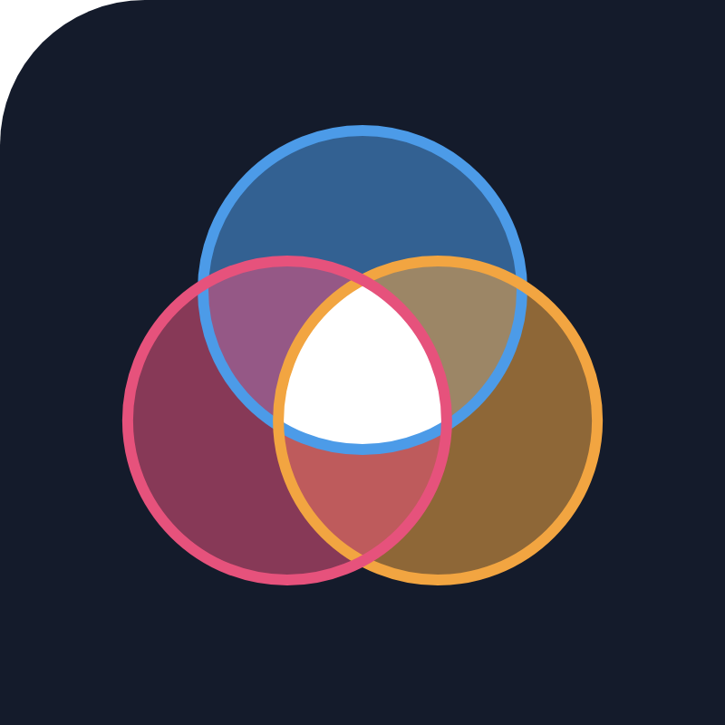
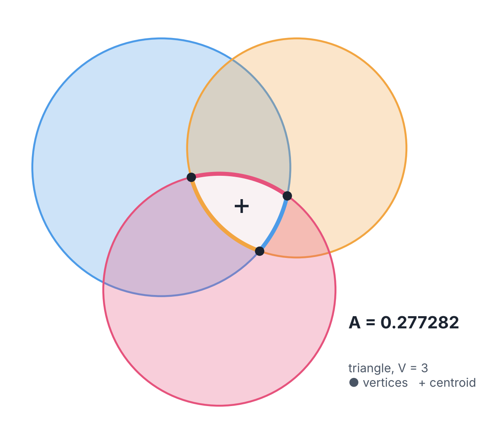

<p align="center">
  
</p>

<h1 align="center">reuleaux</h1>

<p align="center"><b>The exact area of the common overlap of three circles: stable, complete, and fast.</b></p>

<p align="center">
  
</p>

Given any three circles, `reuleaux` returns the area (and centroid, boundary arcs and vertices) of the region that lies inside all of them. It is the missing building block for mutual transits and eclipses of planets, moons and stars, and for area-proportional Venn diagrams.

## Why it is useful

- **Complete.** One proof reduces the geometry to five topologies (empty, disk, lens, circular triangle, circular quadrilateral), resolved by a single directed walk along the boundary arcs. No case tree.
- **Correct for arcs longer than π.** The classical closed forms (Fewell 2006, Kipping 2011) fail when the overlap contains more than half of a disk, by up to 66% of the area.
- **Backward stable.** Against 50-digit references for 21,568 configurations (thin lenses, microscopic triangles, hierarchical star-planet-moon geometries), the error never exceeds 2.01 times the condition number times the unit roundoff.
- **Fast.** 45 ns per configuration on average on one CPU core (0.26 µs in the hardest topology) with Numba.
- **Robust against the alternatives.** Five public packages (gefera, eulerr, venn.js, matplotlib-venn, Shapely) fail on 121 to 21,568 of 40,000 test configurations through undefined values, missing topologies or lost precision. `reuleaux` fails on none.

## Installation

```bash
pip install git+https://github.com/hippke/reuleaux
pip install numba        # optional, 50-500x faster; first call compiles and caches the kernels
```

Requires Python ≥ 3.9 and NumPy. Matplotlib is only needed for plotting.

## Usage

The figure above takes ten lines:

```python
import matplotlib.pyplot as plt
from matplotlib.patches import Circle, Polygon
import reuleaux as rx

circles = [(0, 0, 1.0), (1.05, 0.15, 0.85), (0.45, -0.95, 0.9)]   # (x, y, r)
ov = rx.overlap(*circles)
print(ov.area, ov.case)                                           # 0.2772820698 triangle

fig, ax = plt.subplots()
for (x, y, r), c in zip(circles, ["C0", "C1", "C3"]):
    ax.add_patch(Circle((x, y), r, color=c, alpha=0.3))
ax.add_patch(Polygon(ov.boundary(), color="k", alpha=0.8))        # the common overlap
ax.scatter(*ov.vertices.T)                                        # its corners
ax.set_aspect("equal"); ax.autoscale_view(); plt.show()
```

The full figure with coloured arcs and labels is made by [`examples/hero.py`](examples/hero.py).

Just the number:

```python
rx.overlap_area((0, 0, 1), (0.8, 0.3, 0.6), (0.5, -0.4, 0.7))     # 0.357820532455879
```

A whole light curve at once (NumPy arrays broadcast; a moon crossing a planet on the stellar limb):

```python
import numpy as np
x = np.linspace(0.8, 1.15, 100)
areas = rx.overlap_area_batch(0, 0, 1.0,   0.98, 0, 0.10,   x, 0.02, 0.05)
```

Everything the result knows:

```python
ov = rx.overlap(c1, c2, c3)
ov.area, ov.case, ov.n_vertices, ov.reflex   # reflex: some boundary arc is longer than pi
ov.vertices, ov.arcs, ov.centroid, ov.boundary()
```

Command line:

```bash
python -m reuleaux area 0 0 1  0.8 0.3 0.6  0.5 -0.4 0.7
python -m reuleaux selftest      # validate against an independent quadrature
python -m reuleaux bench
```

More in [`examples/examples.py`](examples/examples.py) (exomoon eclipse ratio, degenerate input, the historical Fewell error) and [`examples/plot_overlaps.py`](examples/plot_overlaps.py) (all paper figures as vector PDFs).

## How it works

1. Drop any disk contained in another; return a disk, a lens or zero if fewer than three remain or a pair is disjoint.
2. The vertices are the pairwise crossings that lie strictly inside the third disk. There are 0, 2, 3 or 4 of them.
3. Walk the boundary counter-clockwise, arc by arc.
4. Apply Green's theorem per arc. The central angle comes from one `atan2`, so long arcs need no special case, and thin segments use a Taylor series so nothing cancels.

The derivation, proofs and benchmarks are in [`paper/paper.pdf`](paper/paper.pdf); working notes are in [`docs/notes.md`](docs/notes.md).

## Tests and benchmarks

```bash
pip install -e ".[test]" && pytest
python paper/bench/run_accuracy.py     # regenerate the accuracy study
python paper/bench/make_figures.py     # paper figures
```

## The name *reuleaux*

The common overlap of three circles whose centres form an equilateral triangle, each circle passing through the other two centres, is a Reuleaux triangle: the curve of constant width named after Franz Reuleaux (1829-1905). It is the prototype of the shape this code computes, in all its deformed variants.

## Citing

Please cite the accompanying paper (in preparation); details are in [`CITATION.cff`](CITATION.cff).

## About

Licensed under the GNU General Public License v3.0 (see [`LICENSE`](LICENSE)). Developed for the exomoon code [Pandora](https://github.com/hippke/Pandora).
